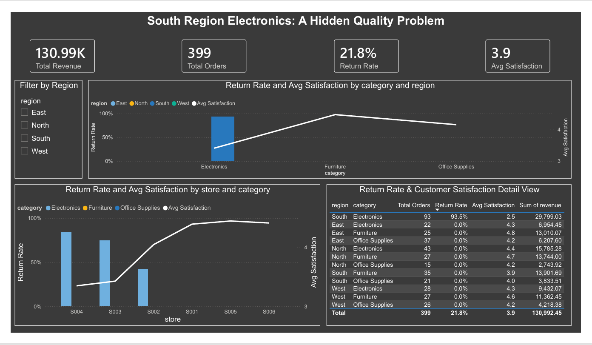

# 📊 South Region Electronics: A Hidden Quality Problem

## 📌 Project Overview

Most data analysis stops at "what happened." This project follows the modern data analytics workflow all the way through to **data storytelling** — answering not just what happened, but why it happened, why it matters, and what each stakeholder should actually do about it.

Built entirely with **SQL (PostgreSQL) + Power BI** — no Excel — following a professional analyst workflow: business question → data modeling → SQL analysis → DAX measures → interactive dashboard → stakeholder-specific recommendations.

---

## 🎯 Business Problem

> While company-wide sales performance looks healthy on the surface, leadership wants to know whether that headline picture is hiding a real, localized operational issue — and if so, where it lives, how severe it is, and what's driving it.

This project investigates that question using 400 sales transactions across 4 regions and 3 product categories.

---

## 🗂️ Dataset

- **400 order-level transactions**
- Columns: `OrderID`, `OrderDate`, `Region`, `Store`, `Category`, `SubCategory`, `Product`, `Channel`, `UnitsSold`, `UnitPrice`, `DiscountPct`, `Revenue`, `Profit`, `Returned`, `CustomerSatisfaction`, `CustomerID`, `PaymentMethod`
- 4 Regions (North, South, East, West), 6 Stores, 3 Categories (Electronics, Furniture, Office Supplies)

  **View DataSet**

[Dataset](data/deepseek_csv_20260728_1955cb.txt)

---

## 🔎 Data Analytics Workflow

### 1️⃣ Ask
**Business Question:** Is there a hidden performance problem inside our sales data, and if so, where does it live and why?

### 2️⃣ Data Modeling (SQL)
```sql
CREATE TABLE retail_sales (
    order_id VARCHAR(20),
    order_date DATE,
    region VARCHAR(20),
    store VARCHAR(20),
    category VARCHAR(30),
    subcategory VARCHAR(30),
    product VARCHAR(50),
    channel VARCHAR(20),
    units_sold INT,
    unit_price DECIMAL(10,2),
    discount_pct DECIMAL(5,2),
    revenue DECIMAL(10,2),
    profit DECIMAL(10,2),
    returned VARCHAR(5),
    customer_satisfaction DECIMAL(3,1),
    customer_id VARCHAR(20),
    payment_method VARCHAR(30)
);
```

### 3️⃣ Data Cleaning (SQL)
One exact duplicate transaction was found and removed:
```sql
DELETE FROM retail_sales
WHERE order_id IN (
    SELECT order_id FROM (
        SELECT order_id,
               ROW_NUMBER() OVER (
                   PARTITION BY order_date, region, store, category, subcategory, product,
                                channel, units_sold, unit_price, discount_pct, revenue, profit,
                                returned, customer_satisfaction, customer_id, payment_method
                   ORDER BY order_id
               ) AS rn
        FROM retail_sales
    ) t WHERE rn > 1
);
```

**View Screenshot**

[Duplicate Removal](sql/duplicate_removal.png)

### 4️⃣ Analysis (SQL) — the drill-down

**Query 1 — Broad scan across every Region × Category (find the outlier honestly, don't assume it)**
```sql
SELECT region, category,
       COUNT(*) AS orders,
       ROUND(AVG(CASE WHEN returned='Yes' THEN 1.0 ELSE 0 END)*100, 1) AS return_rate_pct,
       ROUND(AVG(customer_satisfaction), 1) AS avg_satisfaction
FROM retail_sales
GROUP BY region, category
ORDER BY return_rate_pct DESC;
```
**Result:** South + Electronics = **93.5% return rate**. Every other region-category combination = **0%**.

**View Output**

[Query 1 Result](sql_outputs/Query1.csv)

**Query 2 — Narrow to Store level within South + Electronics**
```sql
SELECT store,
       COUNT(*) AS orders,
       ROUND(AVG(CASE WHEN returned='Yes' THEN 1.0 ELSE 0 END)*100, 1) AS return_rate_pct,
       ROUND(AVG(customer_satisfaction), 1) AS avg_satisfaction
FROM retail_sales
WHERE region = 'South' AND category = 'Electronics'
GROUP BY store
ORDER BY return_rate_pct DESC;
```
**Result:** Stores S002, S003, and S004 all show elevated return rates; S001/S005 have negligible Electronics volume.

**View Output**

[Query 2 Result](sql_outputs/Query2.csv)


**Query 3 — Confirm it's category-specific, not store-wide**
```sql
SELECT store, category,
       COUNT(*) AS orders,
       ROUND(AVG(CASE WHEN returned='Yes' THEN 1.0 ELSE 0 END)*100, 1) AS return_rate_pct
FROM retail_sales
WHERE region = 'South'
GROUP BY store, category
ORDER BY store, category;
```
**Result:** The same South stores' Furniture and Office Supplies orders show a normal 0% return rate — confirming the issue is Electronics-specific, not a store-wide problem.

**View Output**

[Query 3 Result](sql_outputs/Query3.csv)

**Query 4 — Monthly trend (checking for a clean "before/after" cutoff)**
```sql
SELECT DATE_TRUNC('month', order_date) AS month,
       COUNT(*) AS orders,
       ROUND(AVG(CASE WHEN returned='Yes' THEN 1.0 ELSE 0 END)*100, 1) AS return_rate_pct,
       ROUND(AVG(customer_satisfaction), 1) AS avg_satisfaction
FROM retail_sales
WHERE region = 'South' AND category = 'Electronics'
GROUP BY DATE_TRUNC('month', order_date)
ORDER BY month;
```
**Result:** No clean single starting point — the elevated return rate is present from the start of the data and persists throughout the year. **This is a sustained, ongoing issue, not a recent decline.**

**View Output**

[Query 4 Result](sql_outputs/Query4.csv)

### 5️⃣ Dashboard (Power BI)

**DAX Measures:**
```DAX
Total Revenue = SUM(retail_sales[Revenue])
Total Orders = DISTINCTCOUNT(retail_sales[OrderID])
Return Rate = AVERAGE(retail_sales[ReturnFlag])
Avg Satisfaction = AVERAGE(retail_sales[CustomerSatisfaction])
```
*(`ReturnFlag` is a Power Query custom column: `if [Returned] = "Yes" then 1 else 0`)*

**View Screenshot**



**Layout:**
- 4 KPI cards (company-wide, unfiltered): Total Revenue, Total Orders, Return Rate, Avg Satisfaction
- Region slicer (does not affect KPI cards — they always show company-wide totals)
- Chart 1: Return Rate & Satisfaction by Category × Region (the discovery view)
- Chart 2: Return Rate & Satisfaction by Store, filtered to South + Electronics (the drill-down view)
- Detail table: Region, Store, Category, Orders, Return Rate, Avg Satisfaction, Total Revenue (full evidence view, all data, no filters)

### 📊 Dashboard


---

## 📖 The Data Story

### 📌 What happened?
South region's Electronics category has a **93.5% return rate** and **2.5/5 average customer satisfaction** — compared to a **0% return rate** and **4.2+ satisfaction** in every other region-category combination in the company.

### 📌 Why did it happen?
The problem is isolated to three specific South stores (S002, S003, S004) and only their **Electronics** transactions. The same stores' Furniture and Office Supplies orders perform normally, ruling out a store-wide operational issue.

### 📌 Why does it matter?
This isn't a recent trend to monitor — it's been present all year, hidden inside otherwise-healthy company-wide averages. Left unaddressed, it represents ongoing lost revenue (near-total refund rate on Electronics), wasted inventory, and reputational damage in a category customers won't trust again.

### 📌 What should we do next?

🎯 **Regional Director** — *"Is this hurting our overall South region results?"*
→ Not at a region-wide level — Furniture and Office Supplies in South remain healthy. The exposure is fully contained to Electronics.

🎯 **Store Manager (S002/S003/S004)** — *"What's actually happening?"*
→ A near-total return rate specifically on Electronics products, all year — this points to a supplier, fulfillment, or product-quality issue with the Electronics line at these three locations specifically, not a demand or pricing problem.

🎯 **Electronics Category Manager** — *"What should we do about it?"*
→ This is not an emerging trend to watch — it's an existing, severe problem requiring immediate action: audit the Electronics supply chain feeding these three South stores now.

---

## 🛠️ Tools Used
- PostgreSQL (data modeling, cleaning, analysis)
- Power BI (DAX measures, interactive dashboard)

## 📁 Project Structure
```
south-electronics-analysis/
│
├── sql/
│   ├── analysis_queries.sql
│   └── screenshot/
│       ├── create_table.png
│       ├── duplicate_removal.png
│       ├── query1_region_category.png
│       ├── query2_store_level.png
│       ├── query3_category_check.png
│       └── query4_monthly_trend.png
│
├── data/
│   └── retail_sales_south_electronics.csv
│
├── powerbi/
│   └── screenshot/
│       └── returnflag_custom_column.png
│
├── dashboard/
│   ├── south_electronics_dashboard.pbix
│   └── screenshot/
│       └── dashboard.png
│
└── README.md
```

## 👤 Author
Yasir Shah — [@yasirshah-analyst](https://github.com/yasirshah-analyst)
