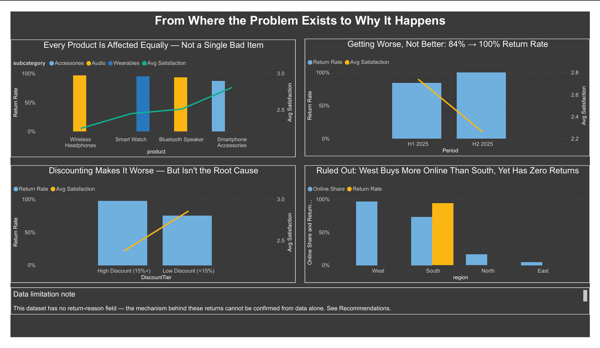

# 📊 South Region Electronics: A Hidden Quality Problem

## 📌 Project Overview
This project was developed as a **portfolio project** to demonstrate an end-to-end data analytics workflow while simulating a real-world business scenario.
Most data analysis stops at answering **"What happened?"** This project follows the modern analytics process all the way through to **data storytelling**, answering:

- What happened?
- Why did it happen?
- Why does it matter?
- What actions should stakeholders take?

Built entirely using **PostgreSQL and Power BI** (without Excel), the project follows a professional analyst workflow:

**Business Problem → Data Cleaning → Data Modeling → SQL Analysis → DAX Measures → Interactive Dashboard → Stakeholder-Focused Insights & Recommendations**

---

## 🎯 Business Problem

>While company-wide sales performance looks healthy on the surface, leadership wants to know whether that headline picture is hiding a real, localized operational issue — and if so, where it lives, how severe it is, and what's driving it.

This project investigates that question using 400 sales transactions across 4 regions and 3 product categories.

---

## 🗂️ Dataset
This project uses a **synthetic retail sales dataset** generated with the assistance of the **DeepSeek AI platform** for portfolio and learning purposes.

The dataset was intentionally designed to simulate a realistic retail environment with return and customer satisfaction patterns suitable for SQL analysis, and Power BI dashboard development.

- **400 order-level transactions**
- Columns: `OrderID`, `OrderDate`, `Region`, `Store`, `Category`, `SubCategory`, `Product`, `Channel`, `UnitsSold`, `UnitPrice`, `DiscountPct`, `Revenue`, `Profit`, `Returned`, `CustomerSatisfaction`, `CustomerID`, `PaymentMethod`
- 4 Regions (North, South, East, West), 6 Stores, 3 Categories (Electronics, Furniture, Office Supplies)

  **View DataSet**

[Dataset](data/deepseek_csv_20260728_1955cb.txt)

---

## 🔎 Data Analytics Workflow

### 1️⃣ Ask
**Business Question:** Is there a hidden performance problem inside our sales data, and if so, where does it live and why?

### 2️⃣ Data Modeling (SQL)
```sql
CREATE TABLE retail_sales (
    OrderID VARCHAR(20),
    OrderDate DATE,
    Region VARCHAR(20),
    Store VARCHAR(20),
    Category VARCHAR(30),
    Subcategory VARCHAR(30),
    Product VARCHAR(50),
    Channel VARCHAR(20),
    UnitsSold INT,
    UnitPrice DECIMAL(10,2),
    DiscountPct DECIMAL(5,2),
    Revenue DECIMAL(10,2),
    Profit DECIMAL(10,2),
    Returned VARCHAR(5),
    CustomerSatisfaction DECIMAL(3,1),
    CustomerID VARCHAR(20),
    PaymentMethod VARCHAR(30)
);
```

### 3️⃣ Data Cleaning (SQL)
One exact duplicate transaction was found and removed:
```sql
DELETE FROM retail_sales
WHERE OrderID IN (
    SELECT OrderID FROM (
        SELECT OrderID,
               ROW_NUMBER() OVER (
                   PARTITION BY OrderDate, Region, Store, Category, SubCategory, Product,
                                Channel, UnitsSold, UnitPrice, DiscountPct, Revenue, Profit,
                                Returned, CustomerSatisfaction, CustomerID, PaymentMethod
                   ORDER BY OrderID
               ) AS rn
        FROM retail_sales
    ) t WHERE rn > 1
);
```

**View Screenshot**

[Duplicate Removal](sql/duplicate_removal.png)

### 4️⃣ Analysis (SQL) — the drill-down

**Query 1 — Broad scan across every Region × Category (find the outlier honestly, don't assume it)**
```sql
SELECT Region, Category,
       COUNT(*) AS orders,
       ROUND(AVG(CASE WHEN Returned='Yes' THEN 1.0 ELSE 0 END)*100, 1) AS return_rate_pct,
       ROUND(AVG(CustomerSatisfaction), 1) AS avg_satisfaction
FROM retail_sales
GROUP BY Region, Category
ORDER BY return_rate_pct DESC;
```
**Result:** South + Electronics = **93.5% return rate**. Every other region-category combination = **0%**.

**View Output**

[Query 1 Result](sql_outputs/Query1.csv)

**Query 2 — Narrow to Store level within South + Electronics**
```sql
SELECT Store,
       COUNT(*) AS orders,
       ROUND(AVG(CASE WHEN Returned='Yes' THEN 1.0 ELSE 0 END)*100, 1) AS return_rate_pct,
       ROUND(AVG(CustomerSatisfaction), 1) AS avg_satisfaction
FROM retail_sales
WHERE Region = 'South' AND Category = 'Electronics'
GROUP BY Store
ORDER BY return_rate_pct DESC;
```
**Result:** Stores S002, S003, and S004 all show elevated return rates; S001/S005 have negligible Electronics volume.

**View Output**

[Query 2 Result](sql_outputs/Query2.csv)


**Query 3 — Confirm it's category-specific, not store-wide**
```sql
SELECT Store, Category,
       COUNT(*) AS orders,
       ROUND(AVG(CASE WHEN Returned='Yes' THEN 1.0 ELSE 0 END)*100, 1) AS return_rate_pct
FROM retail_sales
WHERE Region = 'South'
GROUP BY Store, Category
ORDER BY Store, Category;
```
**Result:** The same South stores' Furniture and Office Supplies orders show a normal 0% return rate — confirming the issue is Electronics-specific, not a store-wide problem.

**View Output**

[Query 3 Result](sql_outputs/Query3.csv)

---

**Query 4 — Is it one specific product, or the whole category?**
```sql
SELECT Subcategory, Product,
       COUNT(*) AS orders,
       ROUND(100.0 * SUM(CASE WHEN Returned='Yes' THEN 1 ELSE 0 END) / COUNT(*), 1) AS return_rate_pct
FROM retail_sales
WHERE Region = 'South' AND Category = 'Electronics'
GROUP BY SubCategory, Product
ORDER BY return_rate_pct DESC;
```
**Result:** Every product is elevated — Wireless Headphones (96.7%), Smart Watch (95.0%), Bluetooth Speaker (92.9%), Smartphone Accessories (86.7%). This rules out a single defective product batch and points toward something affecting the entire Electronics line at these stores (e.g. fulfillment, storage, handling), not a manufacturing issue with one item.

**View Output**

[Query 4 Result](sql_outputs/Query5.csv)

---

**Query 5 — Monthly trend (checking for a clean "before/after" cutoff)**
```sql
SELECT DATE_TRUNC('month', OrderDate) AS month,
       COUNT(*) AS orders,
       ROUND(AVG(CASE WHEN Returned='Yes' THEN 1.0 ELSE 0 END)*100, 1) AS return_rate_pct,
       ROUND(AVG(CustomerSatisfaction), 1) AS avg_satisfaction
FROM retail_sales
WHERE Region = 'South' AND Category = 'Electronics'
GROUP BY DATE_TRUNC('month', OrderDate)
ORDER BY month;
```
**Result:** No clean single starting point — the elevated return rate is present from the start of the data and persists throughout the year. **This is a sustained, ongoing issue, not a recent decline.**

**View Output**

[Query 5 Result](sql_outputs/Query4.csv)

---

**Query 6 — Is the trend improving or worsening?**
```sql
SELECT CASE WHEN OrderDate < '2025-07-01' THEN 'H1 2025' ELSE 'H2 2025' END AS period,
       COUNT(*) AS orders,
       ROUND(100.0 * SUM(CASE WHEN Returned='Yes' THEN 1 ELSE 0 END) / COUNT(*), 1) AS return_rate_pct
FROM retail_sales
WHERE Region = 'South' AND Category = 'Electronics'
GROUP BY CASE WHEN OrderDate < '2025-07-01' THEN 'H1 2025' ELSE 'H2 2025' END;
```
**Result:** H1 2025: **84.2%** → H2 2025: **100.0%**. The problem is actively worsening, not stable or improving.

**View Output**

[Query 6 Result](sql_outputs/Query6.csv)

---

**Query 7 — Does price or discount level explain it?**
```sql
SELECT CASE WHEN DiscountPct >= 0.15 THEN 'High Discount (15%+)' ELSE 'Low Discount (<15%)' END AS discount_tier,
       COUNT(*) AS orders,
       ROUND(100.0 * SUM(CASE WHEN Returned='Yes' THEN 1 ELSE 0 END) / COUNT(*), 1) AS return_rate_pct,
       ROUND(AVG(UnitPrice), 2) AS avg_price
FROM retail_sales
WHERE Region = 'South' AND Category = 'Electronics'
GROUP BY CASE WHEN DiscountPct >= 0.15 THEN 'High Discount (15%+)' ELSE 'Low Discount (<15%)' END;
```
**Result:** Low discount: 75.0% return rate (avg price $73.12). High discount: 97.4% (avg price $86.48). Heavy discounting compounds the problem — but doesn't cause it: even the low-discount group sits at 75%, far above the 0% baseline everywhere else in the business.

**View Output**

[Query 7 Result](sql_outputs/Query7.csv)

---

**Query 8 — Is it a regional purchasing/channel behavior?**
```sql
SELECT Region, Channel,
       COUNT(*) AS orders,
       ROUND(AVG(UnitsSold), 1) AS avg_units_per_order
FROM retail_sales
WHERE Category = 'Electronics'
GROUP BY Region, Channel
ORDER BY Region;
```
**Result:** South is 73% online — but West is 96% online with a **0% return rate**, ruling out purchase channel as the explanation. Average order size is flat (4.0–5.7 units) across every region. This rules out a broader customer-behavior explanation and points back to something specific to South's stores or fulfillment operations.

**View Output**

[Query 8 Result](sql_outputs/Query8.csv)

---


### 5️⃣ Dashboard (Power BI)

**DAX Measures:**
```DAX
Total Revenue = SUM(retail_sales[Revenue])
Total Orders = DISTINCTCOUNT(retail_sales[OrderID])
Return Rate = AVERAGE(retail_sales[ReturnFlag])
Avg Satisfaction = AVERAGE(retail_sales[CustomerSatisfaction])
```
*(`ReturnFlag` is a Power Query custom column: `if [returned] = "Yes" then 1 else 0`)*

**View Screenshot**

[returnflag custom column](power_query/returnflag.png)

**Layout:**
- 4 KPI cards (company-wide, unfiltered): Total Revenue, Total Orders, Return Rate, Avg Satisfaction
- Region slicer
- Chart 1: Return Rate & Satisfaction by Category × Region (the discovery view)
- Chart 2: Return Rate & Satisfaction by Store, filtered to South + Electronics (the drill-down view)
- Detail table: Region, Store, Category, Orders, Return Rate, Avg Satisfaction, Total Revenue (full evidence view, all data, no filters)

**📊 Dashboard**




---

## 📖 The Data Story
 
### 📌 What happened?
South region's Electronics category has a **93.5% return rate** and **2.5/5 average customer satisfaction** — compared to a **0% return rate** and **4.2+ satisfaction** in every other region-category combination in the company. Approximately **$28,134 in revenue (94.4% of the category's South revenue)** is tied to returned orders.
 
### 📌 Where is it located? (established directly by the data)
The problem is isolated to three specific South stores (S002, S003, S004) and only their **Electronics** transactions — the same stores' Furniture and Office Supplies orders perform normally, ruling out a store-wide operational issue. It is also **not** explained by:
- **A single bad product** — every Electronics product shows an elevated return rate (86.7%–96.7%)
- **Discounting alone** — even low-discount orders sit at 75%, far above the healthy baseline
- **Purchase channel or buying behavior** — West is more online-skewed than South (96% vs 73%) yet shows 0% returns
### 📌 Why is it happening? (hypothesis, not yet confirmed)
The pattern — uniformly elevated across all products, worsening over time, unrelated to channel or discount level, confined to specific stores — is most consistent with a **fulfillment, handling, or storage issue specific to these three stores' Electronics operations**, rather than a single defective product or a broader customer-behavior pattern. **This dataset has no return-reason or feedback text field, so this remains the leading hypothesis, not a confirmed cause** — see Recommendations below for what would be needed to confirm it.
 
### 📌 Why does it matter?
This isn't a stable, ongoing issue to monitor calmly — it's **worsening**: return rate rose from **84.2% in H1 2025 to 100.0% in H2 2025**. Left unaddressed, it represents ~$28K in exposed revenue in this region alone, wasted inventory, and reputational damage in a category customers won't trust again.
 
### 📌 What should we do next?
 
🎯 **Regional Director** — *"Is this hurting our overall South region results?"*
→ Not at a region-wide level — Furniture and Office Supplies in South remain healthy. The exposure is fully contained to Electronics, but it's trending toward total failure in that category (100% return rate as of H2 2025).
 
🎯 **Store Manager (S002/S003/S004)** — *"What's actually happening?"*
→ Every Electronics product is affected equally, ruling out one bad item. The pattern points to something in how Electronics is stored, handled, or fulfilled at these three locations specifically — worth a physical audit of receiving/storage conditions before looking anywhere else.
 
🎯 **Electronics Category Manager** — *"What should we do about it?"*
→ Two actions: (1) begin capturing a return-reason code at point-of-return immediately — this is the single missing piece of data that would convert this from a hypothesis into a confirmed cause, and (2) audit fulfillment/handling at S002, S003, and S004 now, given the trend is worsening, not stable.

---

## ✅ Recommendations

- **Start recording return reasons** whenever a product is returned. This will help identify the exact cause of returns instead of relying on assumptions.

- **Inspect Electronics operations at stores S002, S003, and S004**, including storage, handling, and delivery processes, since the return problem affects all products and is getting worse over time.

- **Focus on store operations first** rather than supplier quality. Because all Electronics products are affected similarly, the issue is more likely related to handling, storage, or fulfillment processes than to a defect from a single supplier.

- **Repeat the analysis after collecting return-reason data** to confirm the true root cause and support more targeted corrective actions.

## 🛠️ Tools Used
- PostgreSQL (data modeling, cleaning, analysis)
- Power BI (DAX measures, interactive dashboard)

## 📁 Project Structure
```
south-electronics-analysis/
│
├── sql/
│   ├── analysis_queries.sql
│   └── screenshot/
│       ├── create_table.png
│       ├── duplicate_removal.png
│       ├── query1_region_category.png
│       ├── query2_store_level.png
│       ├── query3_category_check.png
│       ├── query4_monthly_trend.png
│       ├── query5_product_level.png
│       ├── query6_trend_half.png
│       ├── query7_discount_tier.png
│       └── query8_regional_channel.png
│
├── data/
│   └── retail_sales_south_electronics.csv
│
├── powerbi/
│   └── screenshot/
│       └── returnflag_custom_column.png
│
├── dashboard/
│   ├── south_electronics_dashboard.pbix
│   └── screenshot/
│       ├── dashboard_page1.png
│       └── dashboard_page2.png
│
└── README.md
```
---

## 👤 Author

Yasir Shah | Data Analyst | SQL | Power BI | Excel

- www.linkedin.com/in/yasir-shah-2364183b3
- https://github.com/yasirshah-analyst
- shahyasir443@gmail.com
